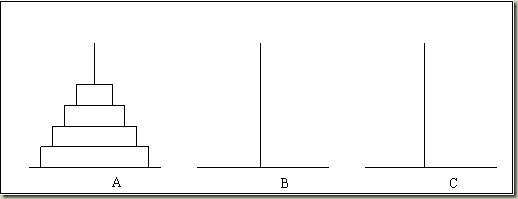

### 功能要求：

1.汉诺塔：汉诺塔（又称河内塔）问题是源于印度一个古老传说的益智玩具。大梵天创造世界的时候做了三根金刚石柱子，在一根柱子上从下往上按照大小顺序摞着64片黄金圆盘。大梵天命令婆罗门把圆盘从下面开始按大小顺序重新摆放在另一根柱子上。并且规定，在小圆盘上不能放大圆盘，在三根柱子之间一次只能移动一个圆盘。

题解：
1. 考虑递推（或归纳）， 设A柱子为起始柱，B柱子为辅助柱，C柱子为目标柱
    假设我们已经求解出A柱子上有i个圆盘时的答案，现在需要求解有i+1个圆盘时的答案；
    第i+1个圆盘在移动前必须保证如下条件：A中最上面的圆盘是i+1，B应该放置1~i的所有圆盘，C是空柱子
    然后再把B当做起始柱，A当做辅助柱，把放置在B上的1~i的所有圆盘依次挪到C
    可得递推式：f[i]=f[i-1]*2+1, f[1]=1
    n=64可以用递推轻松求解(注意要使用unsigned long long)
